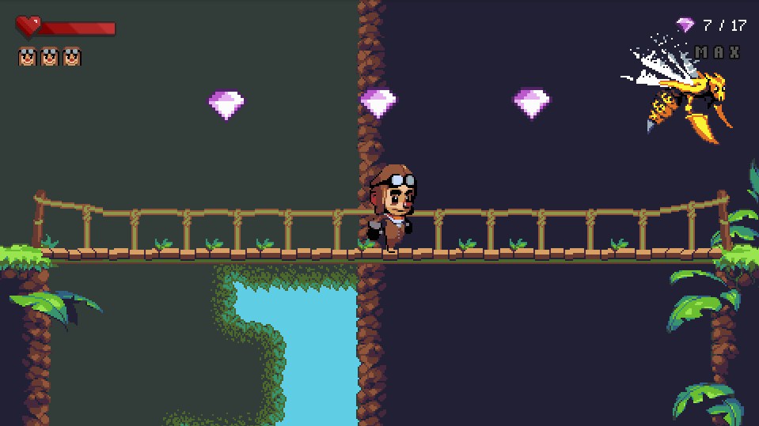
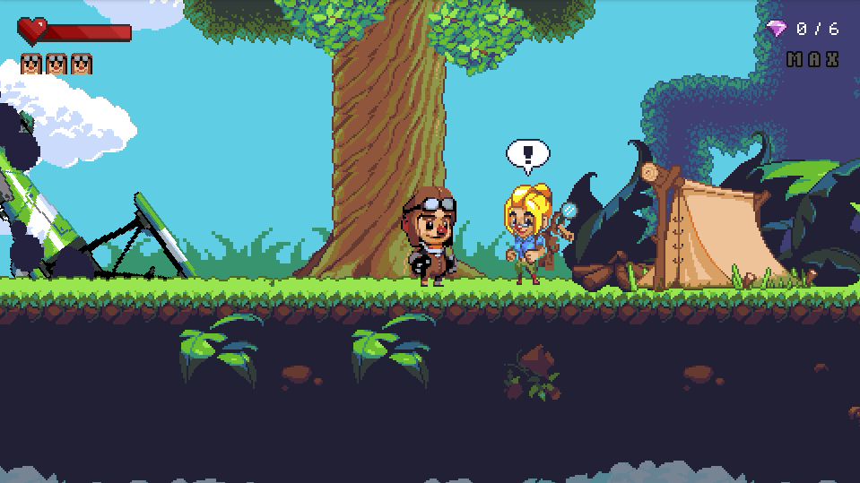

# Maximilien Adventure

A super Mario like created for for the fifth birthday of my nephew Maximilien. 

Since it's gonna be his first video game, the gameplay focus on simplicity. Levels are shorts and permissives. Maximilien adventure is short experience, it can be finish in less than an hour. 

Maximilien Adventure is available in English and French. 

## Preface

Maximilien, a young adventure, survive a terrible plane crash. With the help of some locals, he will needs to get through the jungle and find his brother and sister.

Story will evolve on 19 levels with one unique boss.

## Licenses

All code is licensed under a GNU GPL 2.0 License

All assets, sounds, music, fonts are credited belong and are under their own license. 

## Credits

### Sprites

* [Open Pixel Art project](http://www.openpixelproject.com/) 
* [Sunny Land 2D Pixel Art Pack](https://ansimuz.itch.io/sunny-land-pixel-game-art)
* [Pixel health bar asset pack](https://adwitr.itch.io/pixel-health-bar-asset-pack) 
* [keyboard-controller-keys]( https://hyohnoo.itch.io/keyboard-controller-keys)
* [free-pixel-gamepad-buttons](https://eggboycolor.itch.io/free-pixel-gamepad-buttons)
* [Pixel Parchment UI Kit](https://sasquatchii.itch.io/pixel-parchment-ui-kit)
* [Slime](https://rvros.itch.io/pixel-art-animated-slime)

### Fonts

* [pixelmix font](https://www.dafont.com/fr/pixelmix.font)

* [Joystick monospace](https://www.dafont.com/joystix.font)

* [SFPixelate](https://www.dafont.com/joystix.font?text=SFPixelate)

* [Minecraftia-Regular](https://www.dafont.com/joystix.font?text=Minecraftia-Regular)

* [sh-pinscher](https://www.fontsquirrel.com/fonts/sh-pinscher)

* [lady radical](https://www.dafont.com/lady-radical.font)

### Sounds

* [The Essential Retro Video Game Sound Effects Collection [512 sounds] By Juhani Junkala](https://opengameart.org/content/512-sound-effects-8-bit-style) 

* [robot gibberish.wav](https://freesound.org/people/a_guy_1/sounds/447566)

* [Success Fanfare Trumpets](https://freesound.org/people/FunWithSound/sounds/456966/)

### Musics

* All made by Patrick de Arteaga, listen more at https://patrickdearteaga.com

*Obviously if an asset is not credited, contact me, I always try to credits the asset I use, but something I can just forget to do it.*

